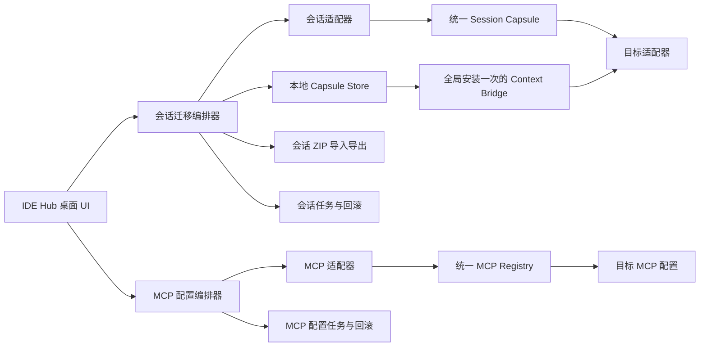
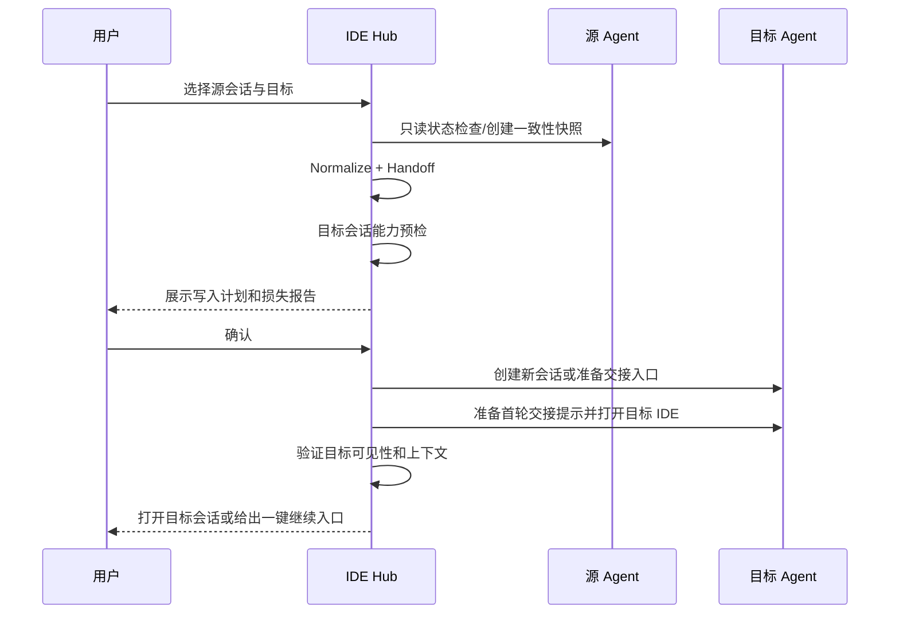

# IDE Hub 本地会话与 MCP 迁移实现方案

> 状态：方案设计<br>
> 调研基线：2026-09-01<br>
> 首期平台：macOS；架构保留 Windows / Linux 适配能力<br>
> 产品形态：纯本地桌面应用；核心迁移不联网、不调用模型、不需要 API Key

任务状态、阶段 Gate 和验收证据统一维护在[任务进度总控](./ide-hub-master-progress.md)中；本文档不作为完成度依据。

## 1. 结论

这个功能可以实现，但“迁移会话”不能定义为把一个产品的 SQLite/JSONL 直接复制到另一个产品中。不同 Agent 的消息类型、工具调用、系统指令、压缩摘要、检查点和文件快照并不等价，很多产品也没有公开任意会话导入接口。

IDE Hub 应采用下面的产品语义：

1. **迁移是复制并分叉，不是搬走**：源会话保持不变，目标端创建一个新会话，并记录来源关系。
2. **优先使用产品本地能力**：官方导入、App Server、IDE IPC、CLI、SDK 优先；私有存储写入必须是版本锁定、字段最小化、可回读和可精确回滚的目标适配器能力。
3. **统一交接包兜底**：所有源会话先转成 IDE Hub 的统一格式，再根据目标能力选择“原生导入”“本地会话投影”或“交接文件”；已全局安装一次的 Context Bridge 可以增强历史回查，但不是会话迁移前置条件。
4. **追求语义连续，不承诺运行时完全等价**：目标 Agent 应知道当前目标、已确认事实、关键决策、修改文件、验证结果、未完成项和下一步；原 Agent 的隐藏思维、权限状态、运行中进程、检查点等不做伪迁移。
5. **会话与 MCP 完全拆分**：会话迁移不读取、不写入用户 MCP 配置，也不要求先迁移 MCP。MCP 是产品级全局配置，按“源产品 → 目标产品”独立迁移一次，拥有单独的页面、任务、备份和回滚。

IDE Hub 的迁移过程是确定性的本地数据转换：读取源会话，规范化消息和工具结果，生成交接包，再通过目标端公开接口或本地文件完成写入。**整个过程不需要联网、不需要调用大模型，也不要求用户配置任何模型 API Key。** 用户在目标 IDE 中继续对话时，目标 IDE 是否联网、使用什么账号或模型，由目标 IDE 自己负责，与 IDE Hub 无关。

首个可交付闭环建议定为：

> 会话闭环：Codex 会话 → IDE Hub Capsule → Qoder 国际版同工作区会话。MCP 闭环：Codex 全局 MCP → Cursor 全局 MCP。两个闭环独立验收，互不作为前置条件。

## 2. 产品目标与非目标

### 2.1 目标

- 扫描本机已安装的 Codex、Qoder / Qoder CN、Cursor、ZCode、CodeBuddy、Claude Code、DeepSeek Harness、Pi。
- 在一个桌面窗口中查看各产品的本地会话，选择源会话和目标 Agent。
- 将源会话的有效上下文带入目标端，并能在目标端继续下一轮对话。
- 支持单个或批量会话导出为标准 ZIP，在另一台电脑离线导入后恢复到相同或不同的目标 Agent。
- 导入时支持重新映射项目路径；可选携带 Git 提交、未提交修改和未跟踪文件，使另一台电脑能够从同一代码状态继续。
- 迁移用户级、项目级和本地级 MCP 配置，展示字段差异、冲突和目标端不支持项。
- 全程离线执行；不提供 IDE Hub 云服务，不上传会话和配置。
- 所有写操作可预览、可审计、可回滚；源数据始终只读。

### 2.2 非目标

- 不保证两个模型得到完全相同的后续回答。
- 不迁移隐藏思维链、账号登录态、OAuth token、设备凭据、额度和计费信息。
- 不迁移运行中的终端进程、后台任务、未完成工具调用和待审批弹窗。
- 不把 Cursor/Claude/Codex 的私有数据库格式包装成“稳定公共协议”。
- IDE Hub 不内置总结模型，不要求 OpenAI、Anthropic、DeepSeek 等模型 API Key。
- MVP 不做多个 Agent 同时写同一会话，也不做实时双向合并。
- 不删除源会话；“移动并删除源”不进入首版。
- 不根据某个会话的历史工具调用自动修改 MCP 配置；历史工具记录只作为会话证据。

### 2.3 网络和模型依赖

| 操作 | IDE Hub 是否联网 | 是否调用模型/API Key |
|---|---:|---:|
| 扫描、读取和解析本机会话 | 否 | 否 |
| 生成 Capsule/Handoff | 否 | 否 |
| 导出或导入便携 ZIP | 否 | 否 |
| 转换并写入 MCP 配置 | 否 | 否 |
| 创建本地导入文件、Context Bridge、打开目标 IDE | 否 | 否 |
| 用户在目标 IDE 中点击“继续” | 由目标 IDE 决定 | 使用目标 IDE 已有账号或模型配置，不经过 IDE Hub |
| 验证远程 HTTP/SSE MCP | 可选，默认不执行 | 与模型无关 |

本文中的“API/SDK”仅指目标产品提供的本地会话管理接口，例如本地进程 IPC、App Server 或 SessionManager，不是模型推理 API。

## 3. 迁移能力分级

IDE Hub 对每个目标端动态声明能力，不在 UI 中统一显示为“100% 原生迁移”。

| 等级 | 名称 | 行为 | 连续性 | 风险 |
|---|---|---|---|---|
| A | 官方原生导入 | 调用目标产品公开的导入/API/SDK，目标历史列表中出现可继续会话 | 最好 | 最低 |
| B | 官方本地会话投影 | 用公开导入/Session API 在本地写入可恢复会话，不触发模型请求 | 高 | 低 |
| C | 交接文件 | 生成本地交接文件，由用户在目标端发起首轮；若已全局配置 Context Bridge，可按需回查历史 | 中高 | 低 |
| D | 实验性原生投影 | 将统一事件映射为目标公开事件模型，仅对明确版本开放 | 高 | 中高 |
| X | 不支持 | 目标缺少可验证的写入路径，或版本无法识别 | 无 | 拒绝执行 |

默认选择顺序为 `A → B → C`。D 只在实验开关、版本锁定、完整备份和真实回归测试都满足时开放。

## 4. 当前事实与能力矩阵

### 4.1 本机基线

当前开发机已发现：

| 产品 | 本机版本/状态 | 已发现的本地数据 |
|---|---|---|
| Codex | `codex-cli 0.151.0` | `~/.codex/sessions/**/*.jsonl`，App Server，可读取会话状态库 |
| Qoder 国际版 | IDE `1.27.1`、App `0.1.4` | IDE 后端 Unix socket、`SharedClientCache/cache/db/local.db`、`~/.qoder/projects/<project>`；首条实现复用 IDE 原生历史写入 |
| Qoder CN | IDE `1.27.1`、App `0.1.1` | `QoderCN/SharedClientCache`、`qodercn.sock`、本地 SQLite；已接入原生历史写入 |
| Cursor | App `3.18.9` | `~/.cursor/projects/**/agent-transcripts/*.jsonl`、`workspaceStorage/**/state.vscdb` |
| Claude | Desktop App `1.15962.1` | `~/.claude/projects/**/*.jsonl` |
| CodeBuddy CN | App `4.11.2` | `~/.codebuddy` 配置存在；当前未发现可用于验收的 CLI 会话样本 |
| DeepSeek Harness | `dsh 0.1.0-rc.6` | `~/.dsh/sessions/**/*.jsonl.zstd` |
| ZCode | 未发现安装 | 待安装后做真实存储探测 |
| Pi | 未发现安装 | 待安装后做 SDK/JSONL 实测 |

这些路径只作为当前版本探针，不直接写死在业务逻辑中。适配器必须同时检查官方默认路径、应用 bundle 内运行时、环境变量覆盖和版本号。

### 4.2 会话适配矩阵

| 产品 | 作为源读取 | 作为目标继续 | 首版策略 | 主要限制 |
|---|---|---|---|---|
| Codex | 高：优先 App Server `thread/list`、`thread/read`；paginated thread 使用 `thread/turns/list`、`thread/items/list`，JSONL 仅作补充 | 中高：Claude/Cursor 使用官方 `/import`；其他源准备 Handoff，由用户在 Codex 中继续 | A/C | 官方 `/import` 当前只支持 Claude Code/Cursor，且 CLI 限近 30 天、最多 50 个 chat；无公开任意外部事件注入 API |
| Qoder 国际版 | 高：IDE 本地会话 API + 当前版本项目数据只读探针 | 高：IDE IPC `session/new` + 每轮一次 `session/appendHistoryTurn` 写入原生 User/Assistant 历史，精确规范化可见性元数据 | B | Qoder 1.27.1 专用适配；正文由后端加密持久化，迁移标记只进 extra 元数据；未知版本禁止写入 |
| Qoder CN | 高：当前版本项目数据和 IDE 本地会话 API | 高：CN IPC `session/new` + `session/appendHistoryTurn`，精确规范化后进入 Chat History | B | Qoder CN 1.27.1 专用适配；bundle `com.aliyun.lingma.ide`、`QoderCN` runtime/client identity 与国际版严格隔离 |
| Cursor | 中高：官方导出 Markdown；本地历史为 SQLite，当前版本另有 agent transcript JSONL | 低：未发现官方任意会话导入 API | C | 导出的 Markdown 可能缺少工具调用、附件和文件编辑细节；不得直接写 `state.vscdb` |
| ZCode | 中：官方确认会话为本机记录，但未公开外部会话导入格式 | 低：使用交接文件和上下文桥 | C | 内置 `# Conversation` 和 fork 只适用于 ZCode 内部会话；外部迁移接口未公开 |
| CodeBuddy | 高：官方说明 `~/.codebuddy/projects` 中含 JSONL，会话可导出和恢复 | 中：生成 Handoff 并打开目标工作区，由用户发起继续 | C | 当前开发机 CLI 不在 PATH，需要发现 App 内置 runtime；未公开任意第三方历史注入 |
| Claude Code | 中高：官方会话本地保存并可导出/恢复 | 中：生成 Handoff 和启动命令，由用户发起继续 | C | JSONL schema 没有稳定公开版本，解析器必须宽松读取、严格写入禁用 |
| DeepSeek Harness | 高：公开事件溯源 Session 模型和 persistence seam | 中：可通过插件在本地 seed 事件，默认仍走交接 | C/D | developer preview；当前 session format v0 明确不承诺兼容且无格式迁移路径 |
| Pi | 高：公开 JSONL v3、树形会话和 `SessionManager` API | 高：SDK 在本地创建并写入会话条目；后续可扩大规范化事件投影 | B/D | Pi 核心故意不内置 MCP；MCP 依赖第三方扩展，不能静默安装 |

### 4.3 MCP 适配矩阵

| 产品 | 用户级 | 项目级/本地级 | 适配要点 |
|---|---|---|---|
| Codex | `~/.codex/config.toml` 的 `mcp_servers` | `<project>/.codex/config.toml`，仅受信任项目 | TOML；支持 stdio、Streamable HTTP、OAuth/环境变量引用；CLI/IDE/Desktop 共用 |
| Qoder | 国际版 `~/.qoder/mcp.json`；CN `~/.qoder-cn/mcp.json` | 项目 `.qoder/mcp.json` 或 `.mcp.json`；桌面 IDE 未验证 local scope | 以桌面 IDE 的 MCP 设置页与 effective cache 为准；独立 CLI 的 `settings.json` 不能作为 IDE 已识别的证据 |
| Cursor | `~/.cursor/mcp.json` | `.cursor/mcp.json` | 标准 `mcpServers` JSON；支持 stdio/SSE/HTTP；可优先生成目标原生配置 |
| ZCode | `~/.zcode/cli/config.json` 的 `mcp.servers` | `.zcode/config.json` | 兼容 `~/.agents/mcp.json` / `<project>/.agents/mcp.json`；`.zcode` 同作用域有配置时会完全压过 `.agents`，不是 merge |
| CodeBuddy | 国际版与 CN 4.12.0 共用 `~/.codebuddy/mcp.json` | 项目根 `.mcp.json` 或 `mcp.json`；未验证 local scope | 两版保留独立目标身份和原生日志 Gate，但 user scope 写入会同时影响两版；页面必须明确提示共享配置 |
| Claude Code | `~/.claude.json` 中的 user/local server | 项目根 `.mcp.json` | local/project/user 三作用域及优先级不同；项目 MCP 首次使用需重新批准 |
| DeepSeek Harness | profile patch | 项目 patch | 一个 MCP server 映射为一个 `@deepseek-ai/dsh-mcp-client` Cordis plugin；首版只生成/合并 patch，不假设普通 `mcp.json` 原生生效 |
| Pi | 无内置 MCP | 无内置 MCP | 必须由用户明确安装并信任 `pi-mcp-adapter` 等扩展后，才能迁移到其配置格式 |

## 5. 总体架构

当前 MVP 选择 **Electron 44 桌面壳 + TypeScript 核心**。应用以本地 `.app` 运行，页面从 `app.asar` 的 `file://` 载入，不暴露浏览器 URL、不启动 localhost 服务。主进程直接调用已验证的 TypeScript 迁移核心；渲染层只能通过隔离 preload 使用 `scan`、`migrate`、`openQoder` 三个窄 IPC。窗口启用 `contextIsolation`、禁用 `nodeIntegration`、启用 sandbox，并拒绝外部导航、弹窗和权限请求。

原方案的 Tauri/Rust 选型已被当前实现取代：首条迁移核心已经是 TypeScript，Electron 可以复用同一实现并避免维护 CLI、Rust 与 UI 三套调用链。后续只有在包体、性能或签名分发形成实际问题时再评估 Tauri，不作为当前 MVP 前置条件。



核心模块：

- **Desktop Shell**：Electron 主进程、隔离 preload 和本地静态渲染层；不包含 HTTP server。
- **Discovery**：发现应用、CLI、bundle runtime、版本、数据目录和运行状态。
- **Session Reader**：以只读方式列出和读取源会话。
- **Normalizer**：转成统一事件、工作区快照和交接摘要。
- **Migration Planner**：根据目标能力选择 A/B/C/D，生成损失报告和写入计划。
- **Target Writer**：只调用不会触发模型请求的官方本地导入/Session API，或写目标公开配置文件；否则退化为交接入口。
- **MCP Registry**：独立于会话，统一读取、去重、冲突分析和目标格式渲染。
- **Context Bridge MCP**：IDE Hub 自带的全局桥接组件，每个目标产品只配置一次；会话迁移只引用 `migrationId`，不重复改配置。
- **Capsule Store**：在本机保存规范化事件、附件和校验值。
- **Portable Bundle**：把一个或多个 Capsule 及可选工作区增量封装为会话 ZIP；MCP 使用独立配置包。
- **Journal**：会话任务和 MCP 配置任务使用不同 task type、状态机、备份与回滚记录。

### 5.1 为什么不是 N × N 转换

八个产品直接两两转换会产生 56 条方向适配，而且每次格式升级都可能连锁失败。IDE Hub 采用：

```text
任意源格式 → IDE Hub Capsule → 任意目标投影
任意 MCP 格式 → MCP Registry → 任意目标配置
```

新增产品只需要实现一组 source/target adapter，不需要理解其他全部产品。

## 6. IDE Hub Session Capsule

### 6.1 文件格式

单个会话在 IDE Hub 内部保存为 Capsule 目录：

```text
<migration-id>.idehub/
├── manifest.json
├── conversation.jsonl
├── handoff.json
├── handoff.md
├── artifacts/
│   └── <sha256>.<ext>
├── source/
│   └── snapshot.meta.json
├── loss-report.json
└── checksums.sha256
```

跨电脑导出时，将一个或多个 Capsule 封装为标准 ZIP，文件名使用：

```text
ide-hub-export-<yyyyMMdd-HHmmss>-<bundle-id>.zip
```

ZIP 不使用私有压缩格式，用户可用系统工具直接查看。Capsule 和导出 ZIP 都是普通本地文件，不引入 Keychain、加密 Vault 或远端存储。

### 6.2 统一模型

```json
{
  "schemaVersion": 1,
  "hubSessionId": "uuid",
  "lineage": {
    "parentHubSessionId": null,
    "sourceAdapter": "codex",
    "sourceNativeSessionId": "opaque-id",
    "sourceVersion": "0.151.0"
  },
  "workspace": {
    "path": "/absolute/project/path",
    "gitBranch": "feature/example",
    "gitCommit": "optional-sha",
    "dirty": true
  },
  "events": "conversation.jsonl",
  "handoff": "handoff.json",
  "artifacts": [],
  "redactions": [],
  "createdAt": "RFC3339"
}
```

规范化事件至少支持：

- `user_message`
- `assistant_message`
- `tool_call`
- `tool_result`
- `file_change_summary`
- `command_summary`
- `attachment_ref`
- `compaction_summary`
- `checkpoint_boundary`
- `plan_update`
- `todo_update`
- `warning`

每个事件保留：`eventId`、`parentId`、`timestamp`、`role`、`content`、`sourcePointer`、`vendorExtensions` 和内容 hash。

### 6.3 默认不迁移的字段

- 隐藏 reasoning/thinking 原文。
- 账号、token、cookie、OAuth refresh token、设备 ID。
- 待批准请求和产品内部权限缓存。
- 运行中进程 PID、终端句柄、文件锁。
- 目标端不能有效重放的工具调用 ID。
- 产品私有签名、缓存 key、计费字段。

工具调用历史可以作为“历史证据”写入归档，但不能伪装成目标端仍待执行的原生 tool call。

### 6.4 Handoff 结构

目标 Agent 首轮真正需要的是下面这组结构，而不是几十万 token 的原始历史：

```json
{
  "objective": "当前任务目标",
  "instructionSources": [],
  "confirmedFacts": [],
  "decisions": [],
  "constraints": [],
  "workspaceState": {
    "branch": "",
    "commit": "",
    "dirtyFiles": [],
    "changedFiles": []
  },
  "verification": {
    "passed": [],
    "failed": [],
    "notRun": []
  },
  "openQuestions": [],
  "unresolvedRisks": [],
  "nextActions": [],
  "recentTurns": []
}
```

Handoff 每条事实尽量带 `sourcePointer`，让目标 Agent 可以通过 Context Bridge 回查原消息或工具结果。

### 6.5 Handoff 生成与核验规则

1. **只做确定性抽取**：从用户消息、已完成工具结果、Git 状态、改动文件、测试结果和任务列表中提取字段；不调用模型生成摘要。
2. **不猜测缺失信息**：不能由原始记录直接确定的内容标记为 `unresolved`，不自动补全。
3. **来源可回查**：关键事实、决策、失败验证和下一步必须带 `sourcePointer`；导出完成前检查其指向的消息、工具结果或文件快照仍存在。
4. **不迁移供应商隐藏指令**：不复制源产品的 system prompt、隐藏推理、内部策略或权限状态。`instructionSources` 只记录用户可见且允许迁移的项目规则文件。
5. **目标规则优先**：目标会话启动时重新读取目标工作区的 `AGENTS.md`、`CLAUDE.md` 等规则；若与交接包中的旧规则冲突，应报告差异，不静默覆盖。
6. **生成后人工预览**：创建目标会话前展示交接内容、裁剪项和损失报告，用户确认后再写入目标端。

## 7. 会话迁移流程



这条流程禁止调用 MCP 配置编排器。目标产品是否已经拥有用户需要的 MCP，不影响会话 Capsule 的生成、导入或打开。

### 7.1 源会话一致性

1. 先判断会话是否正在运行、是否持有 writer lock、最新 turn 是否完成。
2. 有官方状态 API 时使用官方状态；否则组合进程、锁和文件更新时间判断。
3. 运行中的会话默认拒绝迁移，允许用户选择“等待完成”或“在已完成 turn 边界创建快照”。
4. SQLite 使用只读连接或 SQLite backup API 获得一致性快照，不能单独复制主库而忽略 WAL。
5. JSONL 读取只接受完整行，忽略正在追加的半行，并记录截断边界。
6. 迁移前后记录源文件尺寸、mtime 和 hash，验证源未被 IDE Hub 修改。

### 7.2 上下文装载策略

提供三个档位：

| 档位 | 进入模型上下文 | 本地保留 | 用途 |
|---|---|---|---|
| 精简 | Handoff 结构化字段 + 下一步 | 完整归档 | 普通续做 |
| 标准 | Handoff + 最近 N 轮 + 关键证据 | 完整归档 | 默认 |
| 深度 | 标准内容 + 目标 Agent 通过已全局配置的 Context Bridge 搜索历史 | 完整归档 | 长会话/RCA |

任何档位都不把完整大历史一次性塞入模型上下文。超过目标上下文预算时优先保留目标、约束、已验证事实、当前文件状态和未完成项。

### 7.3 IDE Hub Context Bridge MCP

这是目标端没有原生导入能力时的可选增强。IDE Hub 提供一个本地 stdio MCP 可执行程序，每个目标产品全局配置一次：

```text
ide-hub-context-mcp
```

只读工具：

- `get_handoff(migrationId)`
- `search_history(migrationId, query)`
- `read_event(migrationId, eventId)`
- `list_artifacts(migrationId)`
- `read_artifact_text(migrationId, artifactId)`
- `get_source_provenance(migrationId)`

限制：

- 不提供文件写入、shell、目标 Agent 控制等能力。
- 使用 stdio，不监听端口。
- Capsule 通过 `migrationId` 从本地 Capsule Store 读取，不需要账号、密钥或网络连接。
- 会话迁移只检查 Bridge 是否已配置，不在会话流程里新增、修改或删除任何 MCP server。
- Bridge 未配置时直接使用 `handoff.md`，会话迁移仍可完成；用户可稍后在全局 MCP 页面安装一次。

目标首轮提示模板：

```text
这是从 <source> 分叉出的继续工作会话，迁移 ID 为 <id>。
先读取交接摘要，核对当前工作区、Git 分支和未提交修改；历史工具结果只作为当时证据，
对可能变化的外部状态重新验证。确认理解后，从 nextActions 的第一项继续，不要重复已完成工作。
```

### 7.4 损失报告

迁移确认页不展示虚假的“兼容率百分比”，而是逐项显示：

- 完整保留
- 已摘要
- 仅归档、未注入目标
- 目标不支持
- 需要重新认证
- 需要用户手动确认

至少覆盖：消息、工具调用历史、附件、图片、文件改动、终端输出、检查点、计划/TODO、权限、模型、系统指令和工作区路径。MCP 配置不属于会话损失报告。

### 7.5 跨电脑 ZIP 导入与导出

这是一级功能。用户可以在公司电脑选择一个或多个会话导出为 ZIP，通过 U 盘、移动硬盘、AirDrop 或用户自己选择的传输方式带回家，再由家里电脑上的 IDE Hub 离线导入。IDE Hub 不负责文件传输，也不依赖任何云端服务。

#### 7.5.1 ZIP 目录结构

```text
idehub-export/
├── bundle-manifest.json
├── checksums.sha256
├── sessions/
│   └── <hub-session-id>/
│       ├── manifest.json
│       ├── conversation.jsonl
│       ├── handoff.json
│       ├── handoff.md
│       ├── loss-report.json
│       ├── native/                  # 可选：产品官方导出载荷
│       └── artifacts/
└── workspaces/
    └── <workspace-id>/
        ├── workspace.json
        ├── repo.bundle              # 可选
        ├── working-tree.patch       # 可选
        └── untracked/               # 可选、由用户勾选
```

`bundle-manifest.json` 至少包含：

```json
{
  "bundleVersion": 1,
  "bundleId": "uuid",
  "createdAt": "RFC3339",
  "source": {
    "os": "macos",
    "arch": "aarch64",
    "ideHubVersion": "0.1.0"
  },
  "sessions": [
    {
      "hubSessionId": "uuid",
      "sourceAgent": "codex",
      "workspaceId": "uuid"
    }
  ],
  "workspaces": []
}
```

`checksums.sha256` 用于发现文件传输不完整或 ZIP 损坏，不做账号、联网或远端签名校验。

当源产品提供稳定的官方导出格式时，adapter 可以把官方导出载荷放入 `native/`。在家里导入到同一产品且版本兼容时优先走官方原生恢复；否则使用标准 Capsule。不得把整个私有 SQLite、WAL 或产品数据目录塞入 `native/` 冒充可移植格式。

#### 7.5.2 导出内容档位

| 档位 | 内容 | 适用情况 |
|---|---|---|
| 仅会话 | Capsule、Handoff、附件 | 默认；家里已有相同项目 |
| 会话 + 当前修改 | 上述内容 + 工作区 patch + 所选未跟踪文件 | 家里已有仓库，但需要带走未提交修改 |
| 完整离线工作包 | 上述内容 + Git bundle + 工作区未提交增量 | 家里没有完整代码，或公司电脑存在未推送提交 |

会话 ZIP 永远不包含 MCP Registry 或任何产品的 MCP 配置。跨电脑搬运 MCP 时，在全局 MCP 页面单独导出一个产品级配置包；无论导出多少会话，都只需要导出一次。

#### 7.5.3 工作区便携化

会话上下文往往依赖具体代码状态，因此导出时必须记录 `remote URL`、当前分支、`HEAD`、dirty 状态和原始绝对路径。绝对路径只作为提示，导入时不能直接复用。

Git 工作区支持：

1. 用 `git bundle` 可选打包当前分支及其可达提交，使家里电脑在无网络时也能创建仓库。
2. 用 binary patch 保存 tracked 文件的 staged/unstaged 修改。
3. 未跟踪文件按清单展示，由用户勾选后放入 `untracked/`。
4. submodule、worktree 和嵌套 Git 仓库分别列出，不把多个仓库混成一个补丁。
5. 不默认携带 `node_modules`、构建产物、IDE 索引和其他可重新生成的大目录。
6. 非 Git 项目可选择“仅映射家里已有目录”或“打包用户选择的项目文件”。

#### 7.5.4 导出流程

1. 多选会话，IDE Hub 自动按工作区分组。
2. 为每个会话创建一致性 Capsule。
3. 选择是否包含 Git bundle、未提交修改、未跟踪文件和附件。
4. 生成导出清单，展示 ZIP 预计大小和包含项。
5. 在临时目录完成组装并校验 checksum，最后一次性生成 ZIP。
6. 导出完成后显示 ZIP 路径；后续如何传到家里由用户决定。

#### 7.5.5 导入流程

1. 用户选择 ZIP；IDE Hub 解压到临时 staging 目录。
2. 校验 ZIP 目录结构、`bundleVersion`、文件大小和 checksum；ZIP entry 必须是 staging 内的相对路径；损坏时停止，不产生目标写入。
3. 根据 `bundleId` 检测重复导入，允许“复用已有导入”或“创建副本”。
4. 为每个 workspace 选择：映射到已有本地目录，或从 `repo.bundle` 创建新目录。
5. 预览并应用 `working-tree.patch` 和所选未跟踪文件；存在冲突时保留 staging，不覆盖本地文件。
6. 选择每个会话要恢复到的目标 Agent；默认选择源 Agent，也可以跨产品迁移。同产品存在兼容官方载荷时优先原生恢复。
7. 预览目标会话能力、路径映射和不可恢复项。
8. 通过目标官方接口创建会话载荷，或创建 C 级交接入口，完成后打开目标 IDE；这里不写 MCP 配置。

整个导入过程不联网、不调用模型。若目标端没有离线原生导入接口，导入结果就是本地 Handoff + Context Bridge；用户在目标 IDE 中第一次点击“继续”时，才由目标 IDE 自己调用模型。

#### 7.5.6 路径重映射

导入端维护本次任务的映射表：

```json
{
  "/company/work/project-a": "/Users/me/dev/project-a",
  "/company/work/shared-lib": "/Users/me/dev/shared-lib"
}
```

- `workspace.path`、项目级会话入口和附件引用通过映射表转换。
- 历史消息正文保持原样，避免误改命令输出或普通文本；Context Bridge 返回文件引用时同时给出原路径和映射后路径。
- 无法映射的路径列为导入待办，不阻止其他会话恢复。
- 路径映射只保存在家里电脑的导入任务中，不回写导出 ZIP。

#### 7.5.7 导入边界

- 不恢复源电脑上的 IDE 登录态、账号、运行中进程、终端句柄和待审批操作。
- 不要求源产品和目标产品版本完全相同；由目标 adapter 根据版本能力决定 A/B/C/D。
- 会话 ZIP 不包含 MCP；需要的 MCP 配置通过独立的全局 MCP 配置包导入一次。
- ZIP 是可查看的标准归档，不假设加密；若用户要通过不可信渠道传输，可在 IDE Hub 之外自行加密文件。

## 8. 适配器设计

### 8.1 能力接口

```rust
trait AgentAdapter {
    fn id(&self) -> &'static str;
    fn detect(&self) -> Result<Installation>;
    fn capabilities(&self, version: &Version) -> CapabilitySet;
    fn list_sessions(&self, query: SessionQuery) -> Result<Vec<SessionSummary>>;
    fn snapshot_session(&self, id: &NativeSessionId) -> Result<SourceSnapshot>;
    fn normalize(&self, snapshot: &SourceSnapshot) -> Result<HubSession>;
    fn plan_import(&self, session: &HubSession, target: &Target) -> Result<ImportPlan>;
    fn apply_import(&self, plan: &ImportPlan) -> Result<ImportReceipt>;
    fn verify_import(&self, receipt: &ImportReceipt) -> Result<VerificationReport>;
    fn launch(&self, receipt: &ImportReceipt) -> Result<()>;
}

trait McpAdapter {
    fn read_effective_config(&self, scope: Scope) -> Result<McpSnapshot>;
    fn render_plan(&self, registry: &McpRegistry, scope: Scope) -> Result<ConfigPlan>;
    fn apply_plan(&self, plan: &ConfigPlan) -> Result<ConfigReceipt>;
    fn verify_servers(&self, receipt: &ConfigReceipt) -> Result<McpVerification>;
}
```

### 8.2 版本策略

- 每个适配器声明 `minVersion`、`maxTestedVersion`、schema fingerprints 和能力开关。
- 新版本超出测试范围时仍允许只读探测，但写入能力 fail closed。
- fixture 中出现未知顶层事件可以保留为 `vendor_event`；未知必需字段、乱序或断链则阻止原生投影。
- 每次产品更新后运行适配器契约测试，不能以“能解析 JSON”代替兼容验证。

### 8.3 各目标端落地策略

#### Codex

- 源读取：App Server `thread/list` / `thread/read(includeTurns:false)`；paginated thread 继续调用 `thread/turns/list`、`thread/items/list` 直到 cursor 为空，legacy thread 才使用完整 `thread/read`；必要时只读解析 rollout JSONL。
- 同产品分叉：App Server `thread/fork`。
- 外部导入：Claude Code/Cursor 优先提示官方 `/import`；其他源生成 Handoff 并打开 Codex；如果 Context Bridge 以前已全局配置，则首轮提示携带 `migrationId`。IDE Hub 不调用 `turn/start`，也不在这里修改 MCP。
- 不直接写 `state_5.sqlite`、session JSONL 或 session index。
- 复用现有 `codex-state` 中已验证的 App Server transport 思路，但抽成独立 adapter crate，不耦合现有面板。

#### Qoder 国际版 / Qoder CN

- 源读取：项目 JSONL + state/compression metadata，解析时保留压缩边界。
- 国际版首条目标路径：按 SESSION-MIG-001 打开/复用 Qoder IDE，以本地 IPC `session/new` 和 `session/appendHistoryTurn` 创建同一 `cwd` 的持久会话；禁止调用 `session/prompt` / `chat/ask`。
- Codex 可见消息按 User 边界组成问答轮次，每个轮次单独调用一次 `session/appendHistoryTurn`；同一 User 后的连续 Assistant 消息按源顺序合并为该轮回答。
- 禁止把 Handoff/Seed Markdown 作为一条 User 消息写进会话；migrationId、sourceThreadId 和来源标记只能写入 session/record 的 `extra` 元数据。
- Qoder 1.27.1 的 append-history 会话默认是 `voice`，适配器只对本次新建 session 的 `chat_session` / `chat_record` 类型和来源标记执行事务化规范化，然后用 `chat/getSessionById` 与 `chat/listAllSessions` 双重验收。
- 不复制或拼接 Qoder JSONL，不自行写消息正文或加密字段，不依赖 Qoder CLI/Agent SDK/API Key。
- Qoder CN 与国际版共享 adapter core，但分别使用独立 installation profile、bundle id、数据目录、socket 和 RPC client identity；不得跨产品复用 runtime。
- Codex → Qoder CN 已按 [SESSION-MIG-002](./specs/session-migration-002-codex-to-qoder-cn.md) 接入同工作区 IDE-native history projection，并使用 CN 自己的 `chat/getSessionById` 与 `chat/listAllSessions` 验收。
- 不复制源 JSONL 到目标 projects 目录。

#### Cursor

- 源读取：agent transcript JSONL 优先；SQLite 只作为会话索引/标题补全；旧版本支持官方 Markdown export。
- 目标：生成项目内 `.ide-hub/handoffs/<id>/handoff.md`，打开目标 workspace，并把首轮提示放入剪贴板；后续可提供 Cursor extension 实现更顺滑的命令入口。
- 不修改 Cursor `state.vscdb`，因为 schema 和索引关系未公开且会随版本变化。

#### ZCode

- 会话目标端先实现 C 级交接，不承诺原生外部会话导入；ZCode MCP 支持由独立 MCP adapter 实现。
- 利用其标准 `.agents/mcp.json` 兼容能力时，必须先检查同作用域 `.zcode` 配置是否已使 `.agents` 整体失效。
- 安装真实版本后补充只读 session adapter fixture。

#### CodeBuddy

- 源：读取官方 runtime data 目录 JSONL，或调用 IDE History export。
- 目标：生成 Handoff 并打开 IDE；若 Context Bridge 已全局配置则直接复用。发现官方离线 import API 后再升级为 A/B。
- MCP 使用 JSONC AST 修改，遵循同作用域“只取最高优先级文件”的规则。

#### Claude Code

- 源：按官方 session 目录只读解析；JSONL parser 只依赖 `type/sessionId/cwd/message/content/timestamp` 等最小字段。
- 目标：生成 Handoff 和建议启动命令，用户在 Claude Code 中发起第一轮；IDE Hub 不把 prompt 传给 CLI。
- 永不生成或覆写 Claude 私有 JSONL；OAuth、项目批准和 checkpoints 重新建立。

#### DeepSeek Harness

- 源：读取公开 SessionEvent 模型和 persistence backend。
- 目标首版：生成 Handoff 并打开目标工作区。
- 实验原生投影：实现 IDE Hub DSH plugin，使用 `sessions.create(id, { seed })`；仅锁定已验证的 DSH 版本和 event format。
- MCP：将每个统一 server 渲染为一个 `@deepseek-ai/dsh-mcp-client` plugin row；不得把普通 `mcpServers` JSON 假设为原生配置。

#### Pi

- 源：按公开 v3 session JSONL 和 `id/parentId` 树解析。
- 目标：通过 `SessionManager` 在本地创建并写入会话条目，不发送模型请求；实验阶段再扩大规范化事件投影范围。
- MCP：检测不到受信任 adapter 时显示“不支持”，只提供安装说明；第三方包安装必须由用户明确确认。

## 9. MCP 全局配置迁移

### 9.1 独立领域边界

- MCP 迁移入口只存在于“全局 MCP 配置”页面，不出现在会话迁移、会话 ZIP 导出或会话 ZIP 导入向导中。
- 任务主键是 `mcpMigrationId`，来源是一个产品的有效配置，目标是一个或多个产品；任务不包含 `sessionId`、`hubSessionId` 或 Capsule。
- 典型操作是“把 Codex 当前全部 MCP 配置迁移到 Cursor”，执行一次后即完成。之后迁移 1 个或 100 个会话都不会再次写 Cursor MCP。
- 支持迁移整套配置，也支持用户勾选部分 server；两者都属于产品级配置任务。
- MCP 任务有独立的 diff、journal、备份、回滚和历史记录，不与任何会话任务组成联合事务。
- 会话详情可以展示“历史上调用过哪些工具”作为证据，但不能据此自动安装或修改 MCP。

### 9.2 统一模型

```json
{
  "name": "example",
  "scope": "user",
  "transport": "stdio",
  "command": "npx",
  "args": ["-y", "example-mcp"],
  "cwd": null,
  "env": {
    "EXAMPLE_TOKEN": {
      "kind": "environment_reference",
      "name": "EXAMPLE_TOKEN"
    }
  },
  "url": null,
  "headers": {},
  "enabled": true,
  "toolPolicy": {
    "include": [],
    "exclude": [],
    "alwaysAllow": []
  },
  "vendorExtensions": {}
}
```

`env`、headers、URL query、args 按源配置原样进入本地迁移预览，不发送到任何外部服务。

### 9.3 迁移顺序

1. 用户选择源产品和一个或多个目标产品。
2. 读取源产品当前有效的全局/项目配置，并标注来源层级和覆盖关系。
3. 列出源产品全部 server，用户一次性选择要迁移的集合。
4. 读取各目标产品有效配置，而不是只读某个默认文件。
5. 统一 transport 和字段，生成逐目标、逐 server diff。
6. 对同名 server 提供：跳过、重命名、合并、替换四种策略。
7. 检查目标 transport、命令、PATH、cwd、环境变量名和 scope 是否支持。
8. 对配置中已有的环境变量和值，支持“原样复制”或“仅复制变量引用”，默认沿用源配置语义。
9. 用户确认后为每个目标单独备份并原子写入。
10. 重新读取目标配置，确认语义 round-trip 一致。
11. 本地 stdio MCP 可离线执行 `initialize + tools/list`；HTTP/SSE/WS MCP 的联网检查默认跳过。
12. 产品账号登录态和 OAuth 缓存不是 MCP 配置，目标端需要时自行登录。

### 9.4 不可直接映射项

- `SSE`、`WS`、Streamable HTTP 支持集合不同。
- `trust`、`alwaysAllow` 和 tool allow/deny 的语义不同。
- 某些产品支持 `${VAR}`，某些要求 literal env，某些支持 env pass-through。
- 项目 scope 的批准机制不同。
- DSH 是 Cordis plugin row，不是标准 `mcpServers` 文件。
- Pi 核心无 MCP。

这些字段必须显示为损失或人工动作，不能静默删除。也不自动安装 `mcp-remote`、代理或第三方 bridge 来掩盖不兼容。

### 9.5 配置写入保护

- TOML 使用 `toml_edit` 保留未修改内容和注释。
- JSONC 使用 AST patch，不能 `JSON.parse → stringify` 覆盖用户注释。
- 每次写入创建内容寻址备份和 migration journal。
- 保留原权限、owner 和换行风格，临时文件与目标位于同一文件系统，`fsync + atomic rename`。
- 检查 symlink，拒绝写出已声明的配置根目录。
- 目标应用正在使用且没有官方热更新能力时，只生成计划，等待用户退出或选择重启后应用。

### 9.6 MCP 独立配置包

跨电脑迁移 MCP 使用独立文件，例如：

```text
ide-hub-mcp-codex-20260901.zip
├── mcp-bundle-manifest.json
├── registry.json
├── source-configs/
└── checksums.sha256
```

- 配置包按源产品导出全部或所选 server，不包含任何会话、Handoff、附件或工作区代码。
- 家里电脑导入后进入全局 MCP 页面，再选择 Cursor、Qoder、ZCode 等目标产品执行一次配置迁移。
- 项目级 MCP 的 `cwd` 由 MCP 导入向导单独映射，不复用某个会话迁移任务的路径映射。
- 会话 ZIP 与 MCP 配置包可以分别传输、分别导入、分别回滚，彼此没有 bundle 引用关系。

## 10. 本地存储与离线边界

应用数据目录：

```text
~/Library/Application Support/IDE Hub/
├── ide-hub.sqlite
├── capsules/
├── backups/
├── jobs/
├── fixtures-meta/
└── logs/
```

离线约束：

- IDE Hub 不发起网络请求，不内置模型 SDK，不读取模型 API Key。
- 不启动 HTTP/WebSocket 服务；Context Bridge 只使用本地进程 stdio。
- SQLite 只保存产品、会话、迁移任务和本地路径索引；Capsule 使用普通本地文件。
- 日志、备份和 Capsule 都由用户在本机管理，可随时从应用内删除。
- 不读取或迁移产品账号登录态、浏览器 cookie、遥测标识等与会话/MCP 无关的数据。
- 目标 IDE 继续对话以及远程 MCP server 是否联网，不属于 IDE Hub 迁移流程。

这里唯一必须解决的是**本地数据完整性**：不能改坏源会话，不能误覆盖目标 MCP 配置，失败后必须能从备份恢复。无需为 MVP 引入加密 Vault、Keychain、账号系统、权限系统或网络安全协议。

## 11. 桌面交互

### 11.1 主页面

- 正式 Electron 渲染层直接使用 `prototype/` 的整体布局、导航和操作入口；旧的 `desktop/` 简化 HTML/CSS/JS 已删除。
- 已实现 Codex/Qoder 本机状态、真实 Codex 会话列表、搜索、会话详情，以及源会话、固定同工作区目标、前置检查、投影预览、损失报告、写入计划、执行和真实结果组成的 7 步迁移向导。
- ZIP、全局 MCP 与任务中心保留 prototype 页面结构和入口，统一明确标记为“未实现”，不使用演示数据伪装成功。
- 左侧：已发现产品、版本、安装状态和 adapter 健康状态。
- 中间：按工作区/项目聚合的会话列表，可搜索标题、路径、日期和源产品，支持多选。
- 右侧：选中会话的目标、状态、最近消息、文件修改、验证结果和历史工具调用线索；不提供 MCP 配置写入按钮。
- 顶部固定提供“导入 ZIP”和“导出 ZIP”，不要求先进入迁移向导。

### 11.2 迁移向导

1. 选择源会话。
2. 选择目标 Agent 和目标工作区。
3. 检查源是否空闲。
4. 预览 Handoff。
5. 查看兼容/损失报告。
6. 确认实际写入的会话文件/API/命令。
7. 执行、验证并打开目标会话。

会话迁移向导中不展示 MCP diff，不备份 MCP 配置，不出现“顺便迁移 MCP”选项。

### 11.3 全局 MCP 配置页

- 页面明确标注“按产品配置一次，与会话无关”。
- 支持选择一个源产品、一到多个目标产品，并一次性迁移全部或所选 server。
- 按 server name 展示每个产品中的来源和有效配置。
- 显示 scope、transport、command/url、环境变量名、启用状态和冲突。
- “查看原始配置”默认遮罩值。
- 提供独立的 MCP 配置包导入/导出，不复用会话 ZIP。
- 写入前必须有 diff；完成后按目标产品单独回滚。

### 11.4 外部导入/导出向导

导出页展示：已选会话、关联工作区、附件、Git 状态、未跟踪文件和预计 ZIP 大小。支持一次导出多个工作区中的多个会话；不提供 MCP 选项。

导入页分为四步：

1. ZIP 内容与 checksum 检查。
2. 源路径到本机路径的 workspace 映射。
3. 每个会话的目标 Agent。
4. 实际写入预览、执行结果和打开目标 IDE。

导入完成后，会话先进入 IDE Hub 的“已导入”列表；即使暂时没有安装对应目标 IDE，ZIP 内容也不会丢失，后续安装 adapter 后可以继续恢复。

## 12. 迁移任务状态机

```text
DISCOVERED
  → SOURCE_QUIESCED
  → SNAPSHOT_CREATED
  → NORMALIZED
  → HANDOFF_BUILT
  → TARGET_PREFLIGHTED
  → USER_CONFIRMED
  → CAPSULE_STORED
  → SESSION_ENTRY_CREATED
  → CONTEXT_ATTACHED
  → VERIFIED
  → COMPLETED
```

任何写入后失败进入：

```text
ROLLBACK_PENDING → ROLLED_BACK | ROLLBACK_FAILED
```

会话任务使用 idempotency key。应用崩溃重启后根据 journal 恢复，不能因为按钮重复点击创建多个目标会话。该状态机只包含会话和工作区状态。

MCP 全局配置任务使用独立状态机：

```text
SOURCE_CONFIG_READ → TARGET_CONFIG_READ → DIFF_RENDERED
  → USER_CONFIRMED → TARGET_BACKED_UP → CONFIG_APPLIED
  → ROUNDTRIP_VERIFIED → COMPLETED
```

MCP 任务重复执行时按目标当前有效配置重新生成 diff；不得依赖或查询某个 Session ID。

跨电脑导出状态：

```text
EXPORT_PLANNED → CAPSULES_BUILT → WORKSPACE_DELTA_BUILT
  → ZIP_WRITTEN → CHECKSUM_VERIFIED → EXPORTED
```

外部导入状态：

```text
ZIP_SELECTED → STAGED → BUNDLE_VERIFIED → PATHS_MAPPED
  → TARGETS_PLANNED → USER_CONFIRMED → APPLIED → IMPORTED
```

导入失败时 staging 保留到用户关闭任务或主动删除，不能留下半写入的目标配置。

## 13. 验证与测试门槛

### 13.1 Adapter fixture

- 每个支持版本保存合成的最小、普通、大型、压缩、带工具、带附件、异常中断 fixture。
- fixture 生成器只输出结构和合成内容，不能把真实业务会话提交到仓库。
- 新版本先录入 schema fingerprint，再开放写入能力。

### 13.2 会话迁移验收

构造包含以下 sentinel 的源会话：

- 明确任务目标。
- 两个关键约束。
- 一个已否决方案及原因。
- 三个修改文件。
- 一组通过测试和一个未运行验证。
- 一个未解决问题和明确下一步。
- 一次 MCP 工具结果。

迁移后必须验证：

1. 目标产品原生列表中能看到新会话，或 C 级入口能可靠打开新对话。
2. 目标 Agent 的第一轮确认能复述上述 sentinel，不混淆已完成和未完成状态。
3. 再发一轮“继续”后，目标从正确 nextAction 开始，而不是重复前序工作。
4. 源会话 hash 不变。
5. 会话迁移前后，源产品和目标产品的用户 MCP 配置 hash 均不变。
6. 回滚只删除或恢复会话相关产物，不改动 MCP 配置。

仅生成 Capsule、写出文件、返回 `DONE` 或目标能打开空会话，都不算迁移完成。

### 13.3 配置测试

- MCP 测试单独启动全局配置任务，输入中不得包含 Session/Capsule ID。
- TOML/JSON/JSONC/YAML round-trip。
- 同名 server 的四种冲突策略。
- 多 scope precedence。
- env/header/args/URL 的原样复制与变量引用转换。
- symlink、路径穿越、权限保留、磁盘满、崩溃中断和重复执行。
- 目标进程运行中、配置文件被其他进程修改时的乐观锁失败。

### 13.4 真实版本烟测

每个 adapter 发布前至少通过：

```text
detect → list → snapshot → normalize → plan → apply → target list/read → next turn → rollback
```

MCP 至少通过：

```text
read effective config → render diff → apply → reread → initialize → tools/list
```

### 13.5 跨电脑 ZIP 验收

使用两个互相隔离的临时用户目录模拟公司电脑和家里电脑：

1. 在源目录创建多个 Agent、多个 workspace 和多个会话 fixture。
2. 导出“仅会话”“会话 + 当前修改”“完整离线工作包”三种 ZIP。
3. 在目标目录导入，完成不同绝对路径映射。
4. 校验消息、附件、Handoff、Git HEAD、工作区 patch 和未跟踪文件。
5. 校验重复导入、ZIP 截断、checksum 错误、未知 bundleVersion、路径冲突和磁盘不足。
6. 断言会话 ZIP 中不存在 MCP Registry/源配置，导入前后 MCP 配置 hash 不变。
7. 全流程禁止网络访问，并断言没有模型 API 请求。

## 14. 分阶段实施

### Phase 0：可行性 Gate（1 周）

初始范围是 CLI/测试程序。首条原生历史 Gate 通过后，用户明确要求实现正式本地桌面操作界面，因此 Phase 0 同批次追加了 Electron 首屏与 macOS arm64 `.app` 打包；ZIP、MCP 和多产品 UI 仍属于后续任务。

- 定义 Capsule v1、Handoff v1、Session Portable Bundle v1、MCP Registry v1 和 MCP Config Bundle v1 JSON Schema；两个 bundle schema 不互相嵌套。
- 实现 Codex 只读 App Server adapter。
- 实现 Qoder 国际版会话只读 adapter 和目标 runtime discovery。
- 按 [SESSION-MIG-001](./specs/session-migration-001-codex-to-qoder-international.md) 打通 Codex → Qoder 国际版同工作区 IDE-native history projection；只有 Chat History 可见、可打开，且原生 User/Assistant 正文逐轮回读一致才算目标创建成功。
- 打通 Codex 会话 → ZIP → 隔离用户目录 → Qoder 国际版交接入口的跨电脑模拟闭环。
- 独立实现 Codex MCP → Cursor 的产品级 dry-run renderer，不经过会话迁移编排器。
- 建立 sentinel fixture 和真实下一轮连续性验收。

Gate：会话 ZIP 能在隔离的另一套本机目录中完整导入，离线生成的交接入口能被目标端读取，且两端 MCP 配置 hash 不变。MCP 的 Gate 独立验证 Codex → Cursor 配置 diff、写入和回滚。另做一次人工“继续”烟测验证上下文，但该步骤使用目标 IDE 自己的账号/模型，不是 IDE Hub 运行依赖。

### Phase 1：桌面 MVP（2～3 周）

- 扩展现有 Electron 桌面窗口：补齐损失报告、任务中心和外部 ZIP 导入/导出向导。
- 本地 Capsule Store、journal、备份与回滚。
- Codex、Qoder 国际版、Qoder CN、Claude Code、Cursor source adapter。
- Qoder 国际版与 Qoder CN 使用已验证的 IDE-native history projection；Codex/Claude/Cursor 先实现 C 级 target adapter，有官方离线导入能力的路径单独实现 A/B。
- 独立的全局 MCP 配置页；Codex/Cursor/Qoder/Claude 产品级双向迁移及单独配置包导入/导出。
- IDE Hub Context Bridge MCP。

MVP 完成定义：至少三条真实迁移路径连续通过 sentinel 验收，并完成一次真实两台电脑间的 ZIP 搬运和恢复；不以单纯文件生成作为完成。

### Phase 2：扩大产品矩阵（2～3 周）

- CodeBuddy source/target adapter。
- ZCode source fixture、C 级 target adapter 和 MCP 原生配置。
- Pi source/target SDK adapter；MCP 扩展检测和显式安装流程。
- DeepSeek Harness source adapter、C 级 target 和 Cordis MCP renderer。
- Windows/Linux 路径和进程发现。

### Phase 3：实验原生投影（2 周起）

- Pi 规范化事件投影。
- DSH seed plugin，锁定版本并做 crash recovery/fault injection。
- Cursor/ZCode 只有在发布官方 import API 后才升级到 A/B，不逆向写 DB。
- 支持同一 Hub lineage 多次分叉和从任意迁移点继续。

### Phase 4：受控同步（可选）

- 只做“源会话新增完成 turn → 生成新快照”的单向更新。
- 已在两个目标端同时继续时，不自动合并；创建两个 branch 并要求用户选择。
- 不实现 live shared writer，不让两个 Agent 竞争同一个 native session。

## 15. 建议代码结构

```text
ide-hub/
├── apps/
│   └── desktop/
│       ├── src/
│       └── src-tauri/
├── crates/
│   ├── idehub-core/
│   ├── idehub-schema/
│   ├── idehub-capsule-store/
│   ├── idehub-portable-bundle/
│   ├── idehub-journal/
│   ├── idehub-context-mcp/
│   ├── adapter-sdk/
│   └── adapters/
│       ├── codex/
│       ├── qoder/
│       ├── cursor/
│       ├── zcode/
│       ├── codebuddy/
│       ├── claude-code/
│       ├── deepseek-harness/
│       └── pi/
├── schemas/
│   ├── capsule-v1.schema.json
│   ├── handoff-v1.schema.json
│   ├── mcp-registry-v1.schema.json
│   ├── session-portable-bundle-v1.schema.json
│   └── mcp-config-bundle-v1.schema.json
├── fixtures/
│   └── synthetic/
├── tests/
│   ├── contract/
│   ├── migration/
│   └── integrity/
├── docs/
└── codex-state/              # 现有独立项目，先不耦合
```

## 16. 关键风险与应对

| 风险 | 影响 | 应对 |
|---|---|---|
| 私有格式频繁变化 | 会话漏读或错误写入 | 版本能力表、schema fingerprint、fixture、未知版本关闭写入 |
| 目标无导入 API | 无法在历史列表中还原完整原生会话 | Handoff + Context Bridge；仅在版本锁定、精确字段和真实回归齐备时评估私有元数据适配 |
| 大会话超上下文窗口 | 目标首轮成本高、遗忘重点 | 结构化 Handoff、最近轮次预算、按需使用全局 Context Bridge 检索 |
| 工具结果过时 | 目标错误沿用历史外部状态 | 首轮提示标记为历史证据；对时间敏感信息重新验证 |
| MCP 配置值迁移错误 | 目标 server 无法启动 | 原样预览、变量引用转换、写后重读和回滚 |
| 同名 MCP 语义不同 | 覆盖现有目标配置 | 逐 server diff、显式冲突策略、备份和回滚 |
| 家里电脑项目路径不同 | 会话中的文件引用失效 | 会话 workspace 映射表；原路径保留为 provenance；写入前展示未映射项 |
| 会话流程误写 MCP | 每迁移一次会话都重复覆盖全局配置 | 分离编排器、task type 和 bundle schema；会话 E2E 断言 MCP 配置 hash 不变 |
| 家里缺少提交或未提交代码 | 会话存在但无法从原状态继续 | 可选 Git bundle、binary patch 和未跟踪文件清单 |
| ZIP 损坏或重复导入 | 导入缺文件或重复创建会话 | checksum、staging、bundleId 幂等检查和事务回滚 |
| ZIP 体积过大 | 传输和导入缓慢 | 分档导出；附件/未跟踪文件选择；排除依赖缓存和构建产物 |
| 活跃 writer/并发修改 | 会话或配置损坏 | 只迁移冷会话；官方 API；乐观锁；原子写入 |
| DSH/Pi 插件生态快速变化 | 适配失效或供应链风险 | 版本 pin；第三方扩展显式授权；默认不用实验投影 |
| “看似迁移成功”但上下文不可用 | 用户仍需重新解释 | sentinel 连续性验收和真实下一轮作为完成 Gate |

## 17. 首批开发任务拆分

1. `schema`: Capsule/Handoff/Session Portable Bundle 与 MCP Registry/MCP Config Bundle 两组独立 schema 和 golden fixtures。
2. `portable-core`: 仅处理会话 ZIP 的 pack/unpack、manifest、checksum、staging、重复导入和路径映射。
3. `workspace-bundle`: Git bundle、binary patch、未跟踪文件清单及离线恢复。
4. `codex-source`: App Server list/read/status/snapshot。
5. `qoder-target`: 国际版 IDE runtime/IPC discovery、native User/Assistant turn projection、精确元数据规范化、同 workspace 打开和逐轮正文验证。
6. `context-mcp`: 单 Capsule 只读检索工具。
7. `mcp-core`: 独立的产品级 Cursor/Qoder/ZCode/Codex 解析、字段映射、renderer 与配置包导入/导出。
8. `journal`: 会话任务和 MCP 配置任务分别实现 preview/backup/apply/verify/rollback 状态机。
9. `gate-e2e`: Codex → Qoder 国际版同工作区 sentinel 测试；ZIP 跨电脑路径单独验收。
10. `desktop-shell`: Gate 通过后开发迁移、导入和导出向导。

## 18. 方案决策摘要

- 使用本地桌面应用，不做 Web 控制台。
- 核心迁移完全离线，不调用模型，不需要 API Key。
- 支持单个或批量会话导出为标准 ZIP，并在另一台电脑离线导入。
- 会话 ZIP 不包含 MCP，可选携带 Git 提交和未提交工作区增量；导入时重新映射绝对路径。
- 使用统一 IR，避免两两转换。
- “迁移”默认是 copy + fork。
- 源端永远只读。
- 目标端优先官方 API、IDE IPC、CLI 或 SDK。
- 私有消息正文和未知结构禁止写入；确需修正目标索引元数据时，必须锁定版本、精确 session、事务化、写后回读并提供精确清理。
- Handoff + 只读 Context Bridge 是全产品兜底能力。
- MCP 是产品级全局配置，使用独立页面和配置包按“源产品 → 目标产品”迁移一次；与会话无前后顺序和事务关系。
- 完成标准是目标端真实继续一轮，而不是生成文件。

## 19. 官方资料

- OpenAI：[Import from another agent](https://learn.chatgpt.com/docs/import)、[Codex App Server](https://github.com/openai/codex/blob/main/codex-rs/app-server/README.md)、[Codex MCP](https://learn.chatgpt.com/docs/extend/mcp?surface=cli)
- Qoder：[管理会话](https://docs.qoder.com/zh/cli/sessions)、[MCP reference](https://docs.qoder.com/cli/mcp-reference)
- Cursor：[Chat History](https://docs.cursor.com/en/agent/chat/history)、[MCP](https://docs.cursor.com/context/model-context-protocol)
- Claude Code：[Manage sessions](https://code.claude.com/docs/en/sessions)、[MCP](https://code.claude.com/docs/en/mcp)
- ZCode：[ZCode Agent](https://zcode.z.ai/en/docs/agents)、[MCP](https://zcode.z.ai/en/docs/mcp-services)
- CodeBuddy：[History](https://www.codebuddy.ai/docs/ide/User-guide/History)、[`.codebuddy` Directory](https://www.codebuddy.ai/docs/cli/codebuddy-dir)、[MCP](https://www.codebuddy.ai/docs/cli/mcp)
- DeepSeek Harness：[Sessions](https://deepseek-harness.github.io/deepseek-harness/en/reference/subsystems/session)、[Session persistence](https://github.com/deepseek-ai/deepseek-harness/blob/master/packages/session/session-persistence/README.md)、[MCP client](https://github.com/deepseek-ai/deepseek-harness/blob/master/packages/mcp/mcp-client/README.md)
- Pi：[Sessions](https://pi.dev/docs/latest/sessions)、[Session format](https://pi.dev/docs/latest/session-format)、[Pi design/MCP boundary](https://pi.dev/docs/latest/usage)
